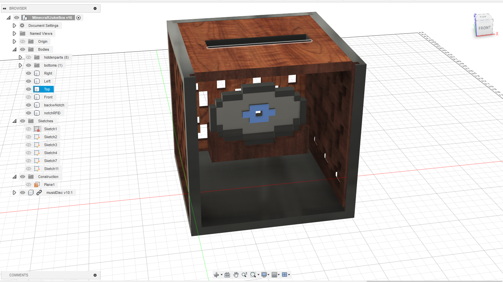

# RFID-minecraft-jukebox
DIY minecraft jukebox that plays music disc via RFID cards

How does it work?
* Uses a raspi 4 hooked up to a RFID module
* RFID stickers on the bottom of the printed disc are read by the module
* Each sticker represents a certain music disc and a simple python code figures out which disc is which
* The code then plays a song based on the disc
* Also the code has basic pause and play functions! 

