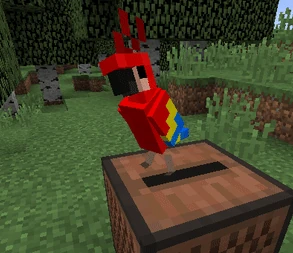

# DISC EJECT
This motion is used to bring the disc out of the jukebox. Based on the in-game punch (right click) that takes the disc out of the jukebox.

This system is based on how pens click in and out of place. I've based off my design from this old tony's 
